<p align="center">
  
  
  
  
  
  
</p>

<h1 align="center">DockGate</h1>

<p align="center">
  <strong>Lightweight, self-hosted Docker management panel.</strong><br>
  No Docker Desktop. No cloud. No registration. Just run and manage.
</p>

<p align="center">
  <a href="#quick-start">Quick Start</a> &middot;
  <a href="#screenshots">Screenshots</a> &middot;
  <a href="#features">Features</a> &middot;
  <a href="#architecture">Architecture</a> &middot;
  <a href="#api-reference">API Reference</a> &middot;
  <a href="#websocket-events">WebSocket</a> &middot;
  <a href="#contributing">Contributing</a>
  <br><br>
  <a href="#az">Azərbaycanca</a>
</p>

---

## What is DockGate?

DockGate is a browser-based Docker control panel that runs as a single container. It connects directly to your Docker socket (`/var/run/docker.sock`) and gives you full control over containers, images, volumes, networks, and compose stacks — all from a clean, macOS-inspired UI.

- **Zero config** — no `.env` files, API keys, or accounts
- **Ultra-lightweight** — ~30-80 MB RAM, <5% CPU at idle
- **Real-time** — live logs, stats, events, and terminal via WebSocket
- **Self-contained** — everything runs inside a single Docker container
- **~5,300 lines of code** — easy to read, easy to contribute

---

## Quick Start

**Prerequisites:** Docker Engine + Docker Compose plugin

```bash
git clone https://github.com/Ali7Zeynalli/dockgate.git
cd dockgate
docker compose up -d --build
```

Open **http://localhost:7077** — that's it.

---

## Screenshots

**Dashboard** — Real-time overview: container counts, disk usage, system info, smart insights
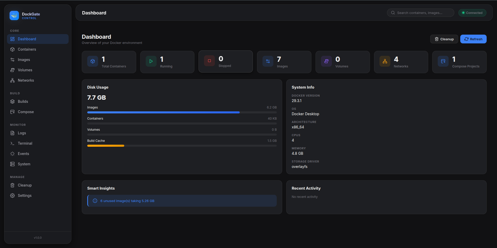

**Containers** — List all containers with status filters, bulk actions, search, group by compose
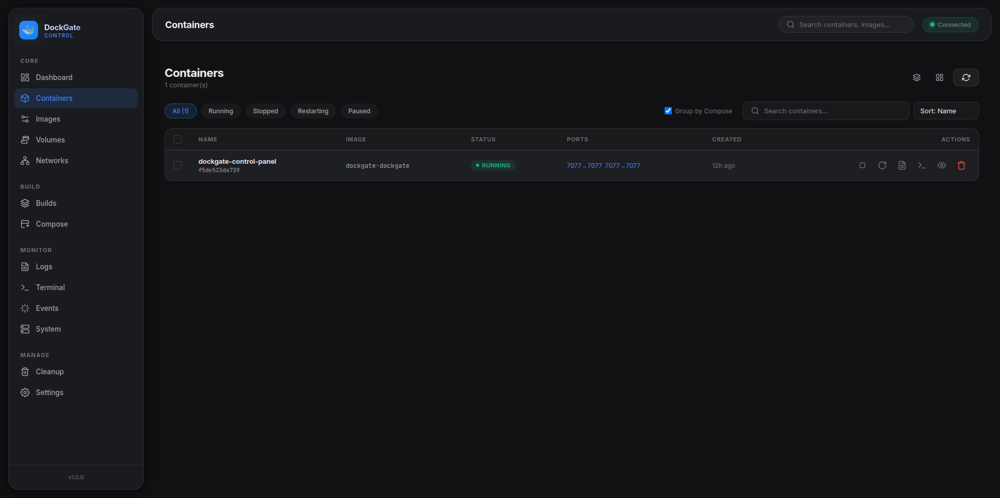

**Container Detail** — 10-tab deep inspect: overview, logs, terminal, stats, environment, ports, volumes, network, inspect, history
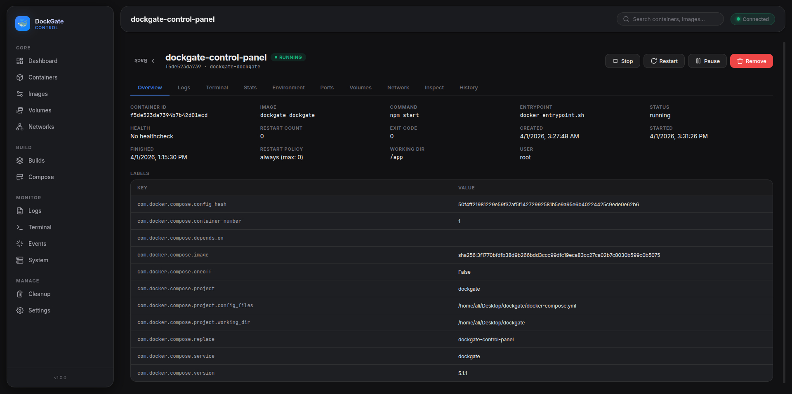

**Images** — Pull, remove, tag images. Filter by in-use, unused, or dangling
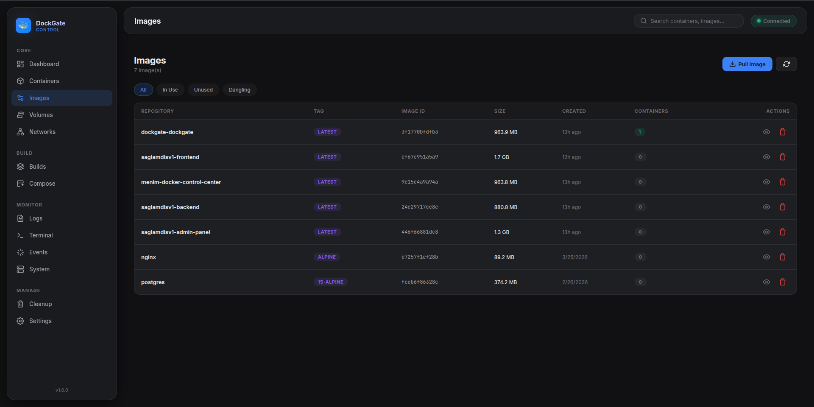

**Volumes** — Track volume usage, see attached containers, prune unused
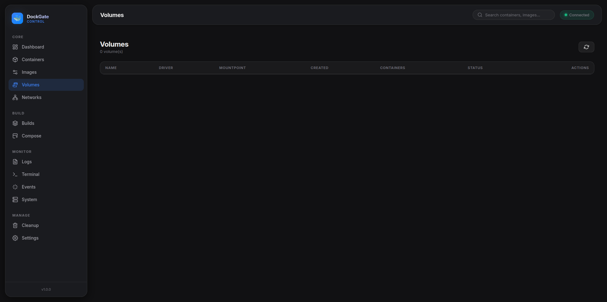

**Networks** — View all Docker networks with driver, subnet, gateway, container counts
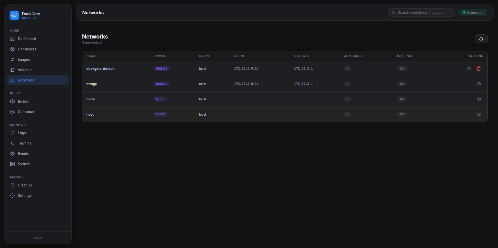

**Builds & Cache** — Monitor build cache entries, clear history to reclaim disk space
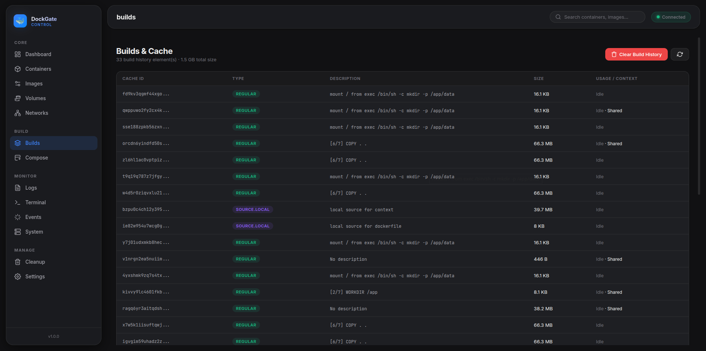

**Compose Projects** — Auto-discover stacks, run up/down/restart/pull actions
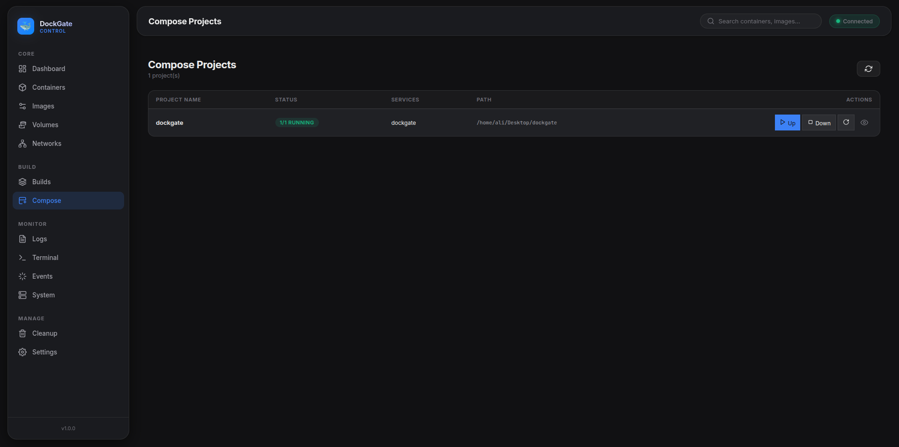

**Logs** — Real-time log streaming with search, timestamps, auto-scroll, word-wrap
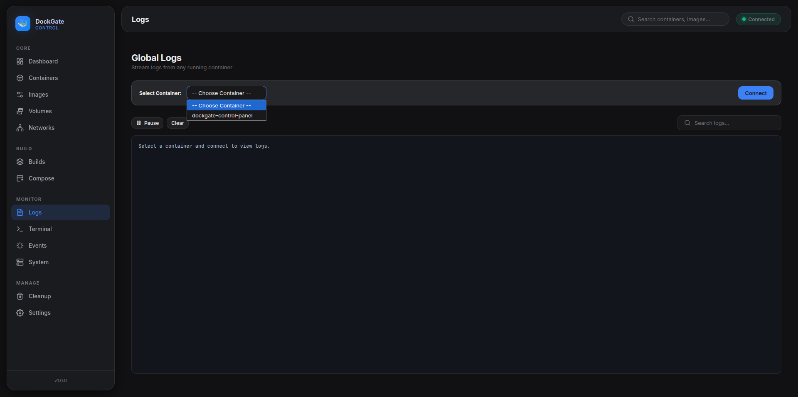

**Terminal** — Interactive shell (bash/sh/zsh) inside any running container via xterm.js
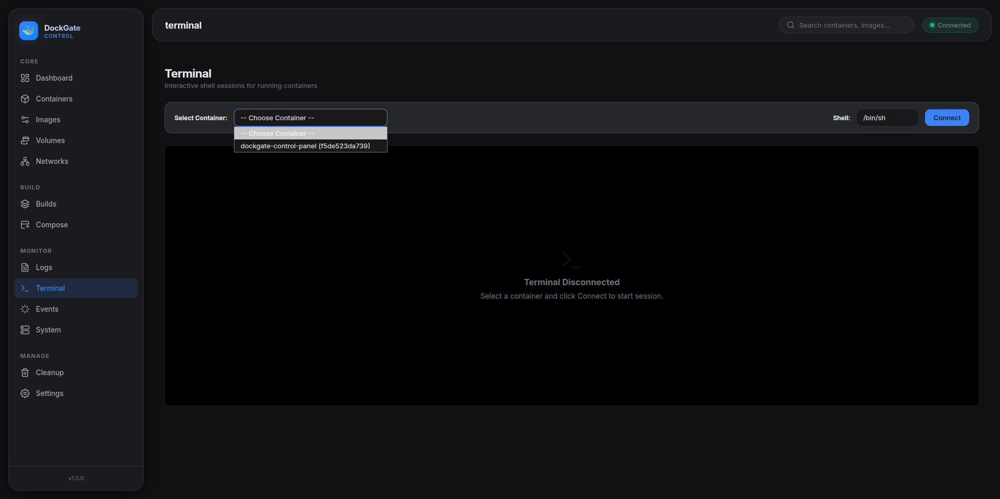

**Cleanup** — Preview what gets deleted before pruning. Reclaim disk space safely
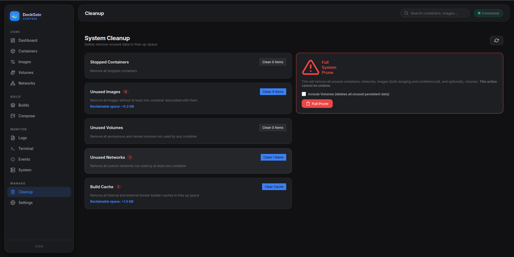

**Settings** — Theme, default shell, log timestamps, default view, auto-start toggle
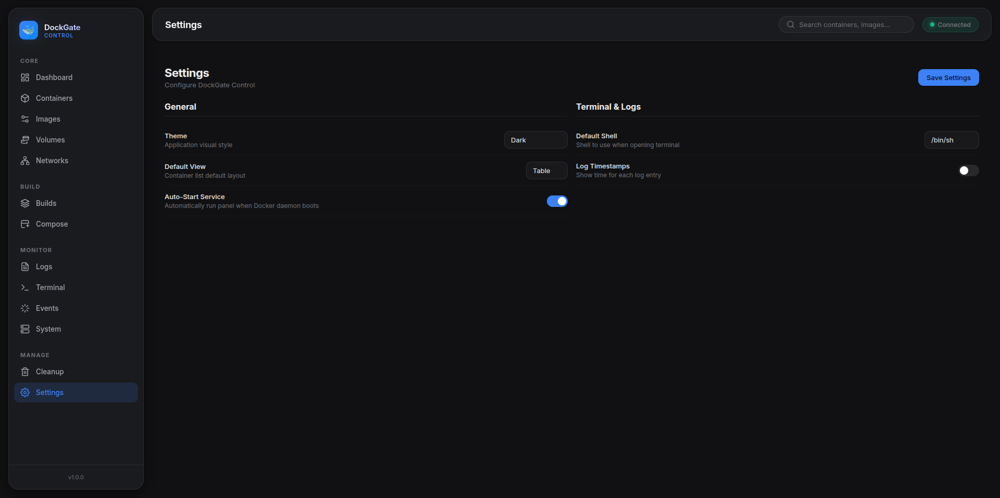

---

## Features

DockGate has **14 modules** organized in 4 groups:

### Core

| Module | Description |
|--------|-------------|
| **Dashboard** | Real-time overview — container counts, disk usage, compose stacks, favorites, activity log, and smart insights (warns about stopped containers older than 7 days, unused images wasting disk, dangling layers) |
| **Containers** | Full fleet management — group by compose project, bulk actions (start/stop/restart/remove multiple), tags, notes, favorites, search by name/image/ID/port, table or card view |
| **Container Detail** | Deep inspect with **10 tabs**: Overview, Logs, Terminal, Stats (live CPU/memory charts), Environment, Ports, Volumes, Network, Inspect (raw JSON), History |
| **Images** | Pull, remove, tag — filter by in-use, unused, or dangling |
| **Volumes** | Track usage, see which containers are attached, prune unused |
| **Networks** | View all network types (bridge, host, overlay, macvlan, none), subnet/gateway info, container counts |

### Build

| Module | Description |
|--------|-------------|
| **Builds** | Docker Desktop-style build management — Build History (Docker image layer history with expandable steps), Build Cache (grouped by image name), Builders (buildx instances), real-time build streaming, build detail with Info/Source/Logs/History tabs |
| **Compose** | Auto-discover projects via `com.docker.compose.project` labels. Stack actions: up, down, restart, pull |

### Monitor

| Module | Description |
|--------|-------------|
| **Logs** | Real-time log streaming with configurable tail (50/100/200/500/1000), timestamps, search filter, auto-scroll, word-wrap |
| **Terminal** | Interactive xterm.js shell with full PTY support — auto-detects bash/sh/zsh, resizable, copy/paste |
| **Events** | Live Docker daemon event stream — create, start, die, destroy, pull, mount, etc. Color-coded by type |
| **System** | Docker version, API version, OS, kernel, CPU count, total RAM, storage driver, interactive disk usage charts |

### Manage

| Module | Description |
|--------|-------------|
| **Cleanup** | Preview-before-prune for: stopped containers, unused/dangling images, unused volumes, unused networks, build cache, or full system prune |
| **Settings** | Theme (dark), refresh interval, default view (table/card), log/terminal defaults, date format, destructive action confirmations, auto-start toggle, **auto-update from GitHub** |

### Container Actions

`start` · `stop` · `restart` · `kill` · `pause` · `unpause` · `remove` · `rename`

---

## Architecture

```
Browser (Vanilla JS + xterm.js + Chart.js)
    │
    ├── HTTP/REST ──► Express API Server
    │                   ├── /api/dashboard
    │                   ├── /api/containers
    │                   ├── /api/images
    │                   ├── /api/builds
    │                   ├── /api/volumes
    │                   ├── /api/networks
    │                   ├── /api/compose
    │                   ├── /api/cleanup
    │                   ├── /api/system
    │                   └── /api/meta
    │
    └── WebSocket ──► Socket.IO
                        ├── logs:subscribe    → real-time log stream
                        ├── stats:subscribe   → CPU/RAM/network/block I/O stream
                        ├── events:subscribe  → Docker daemon events
                        └── terminal:start    → interactive PTY session
                                │
                                ▼
                        Docker Engine (/var/run/docker.sock)
```

### Project Structure

```
dockgate/
├── Dockerfile                    # Node.js 18 Alpine + docker-cli
├── docker-compose.yml            # Deployment with resource limits
├── package.json                  # 4 deps + 1 optional (node-pty)
├── server/
│   ├── index.js                  # Express + Socket.IO server (257 lines)
│   ├── docker.js                 # Docker API wrapper via dockerode (516 lines)
│   ├── db.js                     # SQLite schema & 22 prepared statements (108 lines)
│   └── routes/
│       ├── containers.js         # Container CRUD & actions
│       ├── images.js             # Image pull/remove/tag
│       ├── volumes.js            # Volume CRUD
│       ├── networks.js           # Network CRUD
│       ├── compose.js            # Compose stack orchestration
│       ├── builds.js             # Build cache list & prune
│       ├── cleanup.js            # Prune operations
│       ├── system.js             # System info/version/df
│       └── settings.js           # Favorites, notes, tags, activity, settings, autostart
├── public/
│   ├── index.html                # SPA shell
│   ├── css/
│   │   ├── design-system.css     # Color tokens, typography, spacing
│   │   ├── layout.css            # Sidebar, topbar, page layout
│   │   └── components.css        # Buttons, cards, tables, modals, toasts
│   └── js/
│       ├── app.js                # Sidebar & navigation
│       ├── router.js             # Client-side SPA router
│       ├── store.js              # Simple reactive state store
│       ├── api.js                # HTTP client + Socket.IO + UI utilities
│       └── pages/                # 14 page modules
│           ├── dashboard.js
│           ├── containers.js
│           ├── container-detail.js  # 10-tab detail view (506 lines)
│           ├── images.js
│           ├── volumes.js
│           ├── networks.js
│           ├── compose.js
│           ├── builds.js
│           ├── logs.js
│           ├── terminal.js
│           ├── events.js
│           ├── system.js
│           ├── cleanup.js
│           └── settings.js
└── data/
    └── docker-panel.db           # SQLite (auto-created at runtime)
```

### Tech Stack

| Layer | Technology | Version |
|-------|------------|---------|
| Runtime | Node.js (Alpine) | 18 |
| Web Framework | Express | 4.x |
| Real-time | Socket.IO | 4.x |
| Docker SDK | dockerode | 4.x |
| Database | better-sqlite3 (WAL mode) | 11.x |
| Terminal PTY | node-pty (optional) | 1.x |
| Frontend | Vanilla JS, CSS3 | ES2020+ |
| Terminal UI | xterm.js (CDN) | 5.3.0 |
| Charts | Chart.js (CDN) | 4.4.4 |
| WebSocket Client | Socket.IO Client (CDN) | 4.7.5 |

---

## API Reference

All endpoints are prefixed with `/api`. All responses are JSON.

### Dashboard

| Method | Endpoint | Description |
|--------|----------|-------------|
| GET | `/api/dashboard` | Full summary: container counts, images, volumes, networks, disk usage, insights, favorites, recent activity |

### Containers

| Method | Endpoint | Description |
|--------|----------|-------------|
| GET | `/api/containers` | List all containers (enriched with tags, notes, favorites) |
| GET | `/api/containers/:id` | Full Docker inspect output |
| GET | `/api/containers/:id/stats` | One-shot stats: CPU, RAM, network I/O, block I/O, PIDs |
| GET | `/api/containers/:id/logs` | Fetch logs (`?tail=200&timestamps=false`) |
| POST | `/api/containers/:id/:action` | Execute: `start`, `stop`, `restart`, `kill`, `pause`, `unpause`, `remove`, `rename` |
| POST | `/api/containers` | Create container |

### Images

| Method | Endpoint | Description |
|--------|----------|-------------|
| GET | `/api/images` | List all images (with in-use/dangling flags) |
| GET | `/api/images/:id` | Inspect image |
| POST | `/api/images/pull` | Pull image — body: `{ "image": "nginx:latest" }` |
| DELETE | `/api/images/:id` | Remove image (`?force=true`) |
| POST | `/api/images/:id/tag` | Tag image — body: `{ "repo": "myrepo", "tag": "v1" }` |

### Builds

| Method | Endpoint | Description |
|--------|----------|-------------|
| GET | `/api/builds` | List panel build history |
| GET | `/api/builds/docker-history` | Docker image layer history for all images |
| POST | `/api/builds/docker-history/hide` | Hide image from build history — body: `{ "imageId": "sha256:..." }` |
| DELETE | `/api/builds/docker-history/hidden` | Unhide all hidden images |
| GET | `/api/builds/detail/:id` | Get panel build detail with logs |
| DELETE | `/api/builds/detail/:id` | Delete panel build record |
| DELETE | `/api/builds` | Clear all panel build history |
| GET | `/api/builds/cache` | Build cache grouped by image name |
| POST | `/api/builds/cache/prune` | Clear all build cache |
| GET | `/api/builds/builders` | List buildx builder instances |

### Volumes

| Method | Endpoint | Description |
|--------|----------|-------------|
| GET | `/api/volumes` | List volumes (with attached container info) |
| GET | `/api/volumes/:name` | Inspect volume |
| POST | `/api/volumes` | Create volume |
| DELETE | `/api/volumes/:name` | Remove volume |

### Networks

| Method | Endpoint | Description |
|--------|----------|-------------|
| GET | `/api/networks` | List networks |
| GET | `/api/networks/:id` | Inspect network |
| POST | `/api/networks` | Create network |
| DELETE | `/api/networks/:id` | Remove network |

### Compose

| Method | Endpoint | Description |
|--------|----------|-------------|
| GET | `/api/compose` | List detected projects (via container labels) |
| GET | `/api/compose/:project` | Project details and service list |
| POST | `/api/compose/:project/up` | `docker compose -p <project> up -d` |
| POST | `/api/compose/:project/down` | `docker compose -p <project> down` |
| POST | `/api/compose/:project/restart` | `docker compose -p <project> restart` |
| POST | `/api/compose/:project/pull` | `docker compose -p <project> pull` |

> **Note:** Compose actions require the project's `working_dir` label to be set in containers. This is standard for Docker Compose-created containers.

### Cleanup

| Method | Endpoint | Description |
|--------|----------|-------------|
| GET | `/api/cleanup/preview` | Preview what will be deleted and space to be freed |
| POST | `/api/cleanup/containers` | Prune stopped containers |
| POST | `/api/cleanup/images` | Prune unused images (`?dangling=true` for dangling only) |
| POST | `/api/cleanup/volumes` | Prune unused volumes |
| POST | `/api/cleanup/networks` | Prune unused networks |
| POST | `/api/cleanup/build_cache` | Clear build cache |
| POST | `/api/cleanup/system` | Full system prune (`?volumes=true` to include volumes) |

### System

| Method | Endpoint | Description |
|--------|----------|-------------|
| GET | `/api/system/info` | Docker system info |
| GET | `/api/system/version` | Docker version |
| GET | `/api/system/df` | Disk usage breakdown |

### Metadata

| Method | Endpoint | Description |
|--------|----------|-------------|
| GET | `/api/meta/favorites` | List favorites (`?type=container`) |
| POST | `/api/meta/favorites` | Add favorite — body: `{ "id", "type", "name" }` |
| DELETE | `/api/meta/favorites/:id` | Remove favorite (`?type=container`) |
| GET | `/api/meta/notes` | List all notes |
| GET | `/api/meta/notes/:id` | Get note (`?type=container`) |
| POST | `/api/meta/notes` | Set note — body: `{ "id", "type", "note" }` |
| DELETE | `/api/meta/notes/:id` | Delete note (`?type=container`) |
| GET | `/api/meta/tags` | List all tags |
| GET | `/api/meta/tags/:id` | Get tags for resource (`?type=container`) |
| POST | `/api/meta/tags` | Add tag — body: `{ "id", "type", "tag", "color" }` |
| DELETE | `/api/meta/tags/:id/:tag` | Remove tag (`?type=container`) |
| GET | `/api/meta/activity` | Activity log (`?limit=50`) |
| DELETE | `/api/meta/activity` | Clear activity log |
| GET | `/api/meta/settings` | Get all settings |
| POST | `/api/meta/settings` | Update settings — body: `{ "key": "value" }` |
| GET | `/api/meta/autostart` | Get auto-start status |
| POST | `/api/meta/autostart` | Set auto-start — body: `{ "enabled": true }` |
| GET | `/api/meta/update/check` | Check for updates from GitHub |
| POST | `/api/meta/update/apply` | Pull latest changes and restart server |

---

## WebSocket Events

DockGate uses Socket.IO for all real-time data. Connects on the same port (7077).

### Log Streaming

```javascript
// Subscribe
socket.emit('logs:subscribe', { containerId, tail: 100, timestamps: false });

// Receive
socket.on('logs:data', ({ containerId, data }) => {});
socket.on('logs:end', ({ containerId }) => {});
socket.on('logs:error', ({ containerId, error }) => {});

// Unsubscribe
socket.emit('logs:unsubscribe');
```

### Stats Streaming

```javascript
// Subscribe — fires ~1/sec
socket.emit('stats:subscribe', { containerId });

// Receive
socket.on('stats:data', ({
  containerId,
  cpuPercent,       // 0-100
  memoryUsage,      // bytes
  memoryLimit,      // bytes
  memoryPercent,    // 0-100
  networkRx,        // bytes received
  networkTx,        // bytes transmitted
  blockRead,        // bytes read
  blockWrite,       // bytes written
  pids              // process count
}) => {});
socket.on('stats:end', ({ containerId }) => {});
socket.on('stats:error', ({ containerId, error }) => {});

// Unsubscribe
socket.emit('stats:unsubscribe');
```

### Docker Events

```javascript
socket.emit('events:subscribe');
socket.on('events:data', ({ Type, Action, Actor, time }) => {});
socket.on('events:error', ({ error }) => {});
socket.emit('events:unsubscribe');
```

### Interactive Terminal (PTY)

```javascript
// Start session
socket.emit('terminal:start', { containerId, shell: '/bin/sh' });

// Bidirectional data
socket.emit('terminal:input', rawKeyboardData);
socket.emit('terminal:resize', { cols: 80, rows: 24 });
socket.on('terminal:ready', ({ containerId }) => {});
socket.on('terminal:data', ({ containerId, data }) => {});
socket.on('terminal:end', ({ containerId }) => {});
socket.on('terminal:error', ({ containerId, error }) => {});

// Stop session
socket.emit('terminal:stop');
```

### Build Streaming

```javascript
// Start build
socket.emit('build:start', {
  contextType: 'url',
  contextValue: 'https://github.com/user/repo.git',
  tag: 'myapp:latest',
  dockerfile: 'Dockerfile',
  nocache: false,
  pull: false,
});

// Receive real-time logs
socket.on('build:started', ({ buildId }) => {});
socket.on('build:log', ({ buildId, data }) => {});
socket.on('build:complete', ({ buildId, status, duration, imageId }) => {});
socket.on('build:error', ({ buildId, error }) => {});

// Cancel build
socket.emit('build:cancel');
socket.on('build:cancelled', () => {});
```

---

## Configuration

### Environment Variables

| Variable | Default | Description |
|----------|---------|-------------|
| `PORT` | `7077` | HTTP server port |
| `NODE_ENV` | `production` | Node environment |

### Custom Port

```yaml
ports:
  - "8080:7077"    # Access on localhost:8080
```

### Resource Limits

Enforced via `docker-compose.yml`:

| Resource | Limit | Reserved |
|----------|-------|----------|
| CPU | 0.50 core | 0.05 core |
| RAM | 256 MB | 64 MB |

Typical usage: ~30-80 MB RAM, <5% CPU at idle.

### Default Settings

| Key | Default | Description |
|-----|---------|-------------|
| `theme` | `dark` | UI theme |
| `refreshInterval` | `5000` | Auto-refresh interval (ms) |
| `defaultView` | `table` | Container list view (table/card) |
| `sidebarCollapsed` | `false` | Sidebar state |
| `logTailLines` | `200` | Default log tail |
| `logTimestamps` | `false` | Show timestamps in logs |
| `logAutoScroll` | `true` | Auto-scroll logs |
| `logWrapLines` | `true` | Word-wrap log lines |
| `terminalShell` | `/bin/sh` | Default container shell |
| `terminalFontSize` | `14` | Terminal font size |
| `dateFormat` | `relative` | Date display (relative/absolute) |
| `confirmDestructive` | `true` | Confirm before destructive actions |

### Database

SQLite (WAL mode) at `data/docker-panel.db` — auto-created, persisted via volume mount.

| Table | Purpose | Key Columns |
|-------|---------|-------------|
| `favorites` | Pinned resources | `id`, `type`, `name` |
| `notes` | User notes per resource | `id`, `type`, `note` |
| `tags` | Color-coded labels | `id`, `type`, `tag`, `color` |
| `activity` | Action audit log | `resource_id`, `resource_type`, `action`, `details` |
| `settings` | Panel preferences | `key`, `value` |

All Docker state is read live from the engine — nothing is cached in the database.

---

## Security

> **Warning:** DockGate requires Docker socket access, which grants **root-equivalent control** over the host.

- Do **not** expose port 7077 to the public internet
- No built-in authentication (by design — it's a local tool)
- Socket.IO CORS is set to `origin: '*'` — safe for localhost, but restrict if deploying on a network
- For remote access, use a VPN or SSH tunnel
- Compose actions are executed via `child_process.exec` — only accessible through the API, not user-injectable

---

## Contributing

Contributions are welcome! Here's how:

1. Fork the repository
2. Create a feature branch (`git checkout -b feature/my-feature`)
3. Make your changes
4. Test locally with `docker compose up -d --build`
5. Commit (`git commit -m 'Add my feature'`)
6. Push (`git push origin feature/my-feature`)
7. Open a Pull Request

### Development

```bash
# Run locally without Docker (requires Docker socket access)
npm install
npm run dev
# Server starts at http://localhost:7077
```

---

## License

[MIT](LICENSE) — free to use, modify, and distribute with attribution.

**Original Author: Ali Zeynalli** — this attribution must be preserved in all copies and derivative works.

---

---

<h1 id="az" align="center">DockGate (Azərbaycanca)</h1>

<p align="center">
  <strong>Yungul, self-hosted Docker idarəetmə paneli.</strong><br>
  Docker Desktop lazım deyil. Bulud lazım deyil. Qeydiyyat lazım deyil.
</p>

---

## DockGate nədir?

DockGate brauzerdə işləyən Docker idarəetmə panelidir. Tək bir konteyner olaraq işləyir və Docker soketinə (`/var/run/docker.sock`) birbaşa qoşularaq konteynerlər, imicler, volumlar, şəbəkələr və compose stekləri uzerindən tam nəzarəti təmin edir — hamısı macOS ilhamlı, muasir interfeysdən.

- **Sıfır konfiqurasiya** — `.env` faylı, API açarı və ya hesab tələb olunmur
- **Ultra-yungul** — ~30-80 MB RAM, boş vəziyyətdə <5% CPU
- **Real-time** — canlı loglar, statistika, hadisələr və terminal WebSocket vasitəsilə
- **Mustəqil** — hər şey tək bir Docker konteynerində işləyir
- **~5,300 sətir kod** — oxumaq asan, tohnfə vermək asan

---

## Surətli Başlanğıc

**Tələblər:** Docker Engine + Docker Compose plugin

```bash
git clone https://github.com/Ali7Zeynalli/dockgate.git
cd dockgate
docker compose up -d --build
```

**http://localhost:7077** açın — vəssalam.

---

## Xususiyyətlər

DockGate 4 qrupda **14 modula** malikdir:

### Əsas

| Modul | Təsvir |
|-------|--------|
| **Dashboard** | Real-time icmal — konteyner sayları, disk istifadəsi, compose steklər, favoritlər, fəaliyyət jurnalı, ağıllı xəbərdarlıqlar (7+ gun dayandırılmış konteynerlər, istifadəsiz imiclər, asılı təbəqələr) |
| **Konteynerlər** | Tam donanma idarəetməsi — compose layihəsinə gorə qruplaşdırma, toplu əməliyyatlar (bir neçəsini start/stop/restart/remove), teqlər, qeydlər, favoritlər, ad/imic/ID/port ilə axtarış, cədvəl və ya kart goruntusu |
| **Konteyner Detalları** | **10 tablı** dərin yoxlama: Icmal, Loglar, Terminal, Statistika (canlı CPU/yaddaş qrafikləri), Muhit Dəyişənləri, Portlar, Volumlar, Şəbəkə, Inspect (xam JSON), Tarixçə |
| **İmiclər** | Yukləmə, silmə, teqləmə — istifadə olunan, istifadəsiz və ya asılı filterləmə |
| **Volumlar** | İstifadəni izləmə, hansı konteynerlərin qoşulduğunu gormə, istifadəsizləri təmizləmə |
| **Şəbəkələr** | Butun şəbəkə novləri (bridge, host, overlay, macvlan, none), subnet/gateway məlumatları, konteyner sayları |

### Build

| Modul | Təsvir |
|-------|--------|
| **Buildlər** | Docker Desktop stilində build idarəetmə — Build Tarixçəsi (Docker image layer tarixçəsi açılan step-lərlə), Build Cache (image adına görə qruplaşdırılmış), Builders (buildx instance-lar), real-time build streaming, Info/Source/Logs/History tab-ları ilə build detalı |
| **Compose** | `com.docker.compose.project` etiketləri vasitəsilə layihələri avto-kəşf. Stek əməliyyatları: up, down, restart, pull |

### Monitor

| Modul | Təsvir |
|-------|--------|
| **Loglar** | Konfiqurasiya edilə bilən tail (50/100/200/500/1000), zaman damğası, axtarış filtri, avto-scroll, soz-sarma ilə real-time log axını |
| **Terminal** | Tam PTY dəstəyi ilə interaktiv xterm.js shell — bash/sh/zsh avto-aşkarlama, olcu dəyişdirmə, kopyala/yapışdır |
| **Hadisələr** | Canlı Docker daemon hadisə axını — create, start, die, destroy, pull, mount və s. Novə gorə rəng kodlu |
| **Sistem** | Docker versiyası, API versiyası, ƏS, kernel, CPU sayı, umumi RAM, saxlama surucusu, interaktiv disk istifadəsi qrafikləri |

### İdarəetmə

| Modul | Təsvir |
|-------|--------|
| **Təmizlik** | Onizləmə-sonra-təmizləmə: dayandırılmış konteynerlər, istifadəsiz/asılı imiclər, istifadəsiz volumlar, istifadəsiz şəbəkələr, build keşi, və ya tam sistem təmizliyi |
| **Parametrlər** | Tema (dark), yeniləmə intervalı, defolt goruntu (cədvəl/kart), log/terminal defoltları, tarix formatı, təhlukəli əməliyyat təsdiqləri, avto-başlatma, **GitHub-dan avto-yeniləmə** |

### Konteyner Əməliyyatları

`start` · `stop` · `restart` · `kill` · `pause` · `unpause` · `remove` · `rename`

---

## Arxitektura

```
Brauzer (Vanilla JS + xterm.js + Chart.js)
    │
    ├── HTTP/REST ──► Express API Server
    │                   ├── /api/dashboard     (İcmal)
    │                   ├── /api/containers    (Konteynerlər)
    │                   ├── /api/images        (İmiclər)
    │                   ├── /api/builds        (Build keşi)
    │                   ├── /api/volumes       (Volumlar)
    │                   ├── /api/networks      (Şəbəkələr)
    │                   ├── /api/compose       (Compose steklər)
    │                   ├── /api/cleanup       (Təmizlik)
    │                   ├── /api/system        (Sistem)
    │                   └── /api/meta          (Metadata)
    │
    └── WebSocket ──► Socket.IO
                        ├── logs:subscribe    → real-time log axını
                        ├── stats:subscribe   → CPU/RAM/şəbəkə/blok I/O
                        ├── events:subscribe  → Docker daemon hadisələri
                        └── terminal:start    → interaktiv PTY sessiyası
                                │
                                ▼
                        Docker Engine (/var/run/docker.sock)
```

### Texnologiya Steki

| Qat | Texnologiya | Versiya |
|-----|-------------|---------|
| Runtime | Node.js (Alpine) | 18 |
| Veb Framework | Express | 4.x |
| Real-time | Socket.IO | 4.x |
| Docker SDK | dockerode | 4.x |
| Verilənlər Bazası | better-sqlite3 (WAL mode) | 11.x |
| Terminal PTY | node-pty (istəyə bağlı) | 1.x |
| Frontend | Vanilla JS, CSS3 | ES2020+ |
| Terminal UI | xterm.js (CDN) | 5.3.0 |
| Qrafiklər | Chart.js (CDN) | 4.4.4 |

---

## Konfiqurasiya

### Muhit Dəyişənləri

| Dəyişən | Defolt | Təsvir |
|---------|--------|--------|
| `PORT` | `7077` | HTTP server portu |
| `NODE_ENV` | `production` | Node muhiti |

### Resurs Limitləri

`docker-compose.yml` vasitəsilə tətbiq olunur:

| Resurs | Limit | Rezerv |
|--------|-------|--------|
| CPU | 0.50 nuvə | 0.05 nuvə |
| RAM | 256 MB | 64 MB |

Tipik istifadə: ~30-80 MB RAM, boş vəziyyətdə <5% CPU.

### Defolt Parametrlər

| Açar | Defolt | Təsvir |
|------|--------|--------|
| `theme` | `dark` | UI teması |
| `refreshInterval` | `5000` | Avto-yeniləmə intervalı (ms) |
| `defaultView` | `table` | Konteyner siyahısı goruntusu (cədvəl/kart) |
| `logTailLines` | `200` | Defolt log tail |
| `terminalShell` | `/bin/sh` | Defolt konteyner shell |
| `terminalFontSize` | `14` | Terminal şrift olcusu |
| `dateFormat` | `relative` | Tarix goruntusu (nisbi/mutləq) |
| `confirmDestructive` | `true` | Təhlukəli əməliyyatlardan əvvəl təsdiq |

### Verilənlər Bazası

SQLite (WAL mode) `data/docker-panel.db` unvanında — avto-yaradılır, volume mount ilə saxlanılır.

| Cədvəl | Məqsəd | Əsas Sutunlar |
|--------|--------|---------------|
| `favorites` | Sabitlənmiş resurslar | `id`, `type`, `name` |
| `notes` | Resurs uzrə istifadəçi qeydləri | `id`, `type`, `note` |
| `tags` | Rəng kodlu etiketlər | `id`, `type`, `tag`, `color` |
| `activity` | Əməliyyat audit jurnalı | `resource_id`, `resource_type`, `action`, `details` |
| `settings` | Panel parametrləri | `key`, `value` |

Butun Docker vəziyyəti muhərrikdən canlı oxunur — verilənlər bazasında heç nə keşlənmir.

---

## Təhlukəsizlik

> **Xəbərdarlıq:** DockGate Docker soket girişi tələb edir ki, bu da host uzərində **root-ekvivalent nəzarət** verir.

- 7077 portunu ictimai internetə **açmayın**
- Daxili autentifikasiya yoxdur (dizayn gərəyi — lokal alətdir)
- Socket.IO CORS `origin: '*'` olaraq qurulub — localhost ucun təhlukəsizdir, amma şəbəkədə yayımlayırsınızsa məhdudlaşdırın
- Uzaqdan giriş ucun VPN və ya SSH tunnel istifadə edin

---

## Tohnfə Vermə

Tohnfələr xoş qarşılanır!

1. Reponu fork edin
2. Feature branch yaradın (`git checkout -b feature/menim-feature`)
3. Dəyişikliklərinizi edin
4. Lokal olaraq test edin: `docker compose up -d --build`
5. Commit edin (`git commit -m 'Feature əlavə et'`)
6. Push edin (`git push origin feature/menim-feature`)
7. Pull Request açın

### İnkişaf

```bash
# Docker olmadan lokal işə salma (Docker soket girişi tələb olunur)
npm install
npm run dev
# Server http://localhost:7077 unvanında başlayır
```

---

## Lisenziya

[MIT](LICENSE) — attribution ilə istifadə, dəyişdirmə və paylamaq üçün pulsuzdur.

**Orijinal Müəllif: Ali Zeynalli** — bu attribution bütün kopyalarda və törəmə işlərdə saxlanmalıdır.

---

<p align="center">
  <strong>DockGate</strong> — Docker management without the bloat.
</p>
