<p align="center">
  
  
  
  <a href="CHANGELOG.md"></a>
  
  
</p>

<h1 align="center">DockGate</h1>

<p align="center">
  <strong>Self-hosted Docker control panel — for your local daemon and a fleet of remote hosts over SSH.</strong><br>
  Manage containers, build &amp; deploy, provision fresh servers, monitor hosts, and get alerts — from one clean browser UI.
</p>

<p align="center">
  <a href="#quick-start">Quick Start</a> &middot;
  <a href="#screenshots">Screenshots</a> &middot;
  <a href="#features">Features</a> &middot;
  <a href="#notifications--edge-agent">Notifications</a> &middot;
  <a href="#architecture">Architecture</a> &middot;
  <a href="#security">Security</a> &middot;
  <a href="#api-reference">API</a>
  <br>
  <a href="CHANGELOG.md">📋 Changelog</a>
</p>

---

## What is DockGate?

DockGate started as a lightweight, browser-based Docker UI and has grown into a **self-hosted DevOps + server-management panel**. It runs as a single container, connects to your **local** Docker socket *and* to any number of **remote Docker hosts over SSH**, and lets you operate all of them from one place — behind a single admin login.

- **One panel, many hosts** — switch the active server in the sidebar; the whole UI (containers, images, logs, terminal…) follows it.
- **Run & deploy** — launch containers from a guided form, build images, create & edit Compose projects, and deploy from an App-Templates marketplace.
- **Server management** — add SSH hosts, **provision a fresh server** (update, Docker, fail2ban, swap, firewall, SSH-hardening) with one click, **monitor the host** (CPU/RAM/disk/net/load + host logs), and manage system **services** (ssh / firewall / fail2ban) from a console.
- **Alerts that survive** — Telegram + email notifications on container die/crash/OOM/restart/unhealthy/start/pause/unpause/disk, plus an optional **outbound-only Edge Notifier agent** that keeps alerting even if DockGate itself is offline.
- **Authenticated & audited** — single admin password (scrypt + signed session cookie), encrypted SSH/registry/channel secrets at rest, and a full audit log of every change.
- **Lightweight** — runs in **≤256 MB RAM / ≤0.5 CPU**; vanilla-JS frontend, no build step, fully air-gappable.

> **Honest scope:** DockGate is **single-admin** today — one password, full control. There is no multi-user / RBAC / per-tenant data isolation (yet). See [Security](#security) and [Limitations](#limitations).

---

## Quick Start

**Prerequisites:** Docker Engine + the Docker Compose plugin.

### Option 1 — Pre-built image (recommended)

```bash
mkdir dockgate && cd dockgate
curl -O https://raw.githubusercontent.com/Ali7Zeynalli/dockgate/main/docker-compose.yml
docker compose up -d
```

### Option 2 — Build from source (development)

```bash
git clone https://github.com/Ali7Zeynalli/dockgate.git
cd dockgate
docker compose -f docker-compose.yml -f docker-compose.dev.yml up -d --build
```

Open **http://localhost:7077**. On first run you'll be asked to **set an admin password** (min 8 chars) — after that, every visit requires login.

### Update

Built-in: **Settings → Software Update → Update Now** (pulls the latest image and recreates the container in place). Or manually:

```bash
docker compose pull && docker compose up -d
```

> Source builds don't auto-update — `git pull` and rebuild.

---

## Screenshots

| | |
|:--:|:--:|
| **Login** — single admin password gate | **Dashboard** — active host's Docker + metrics |
| 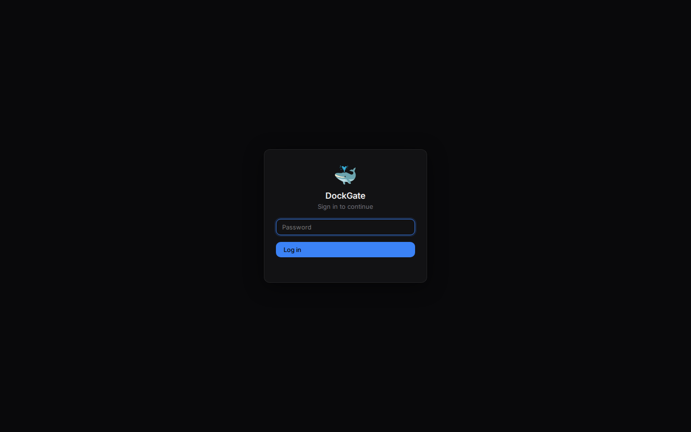 | 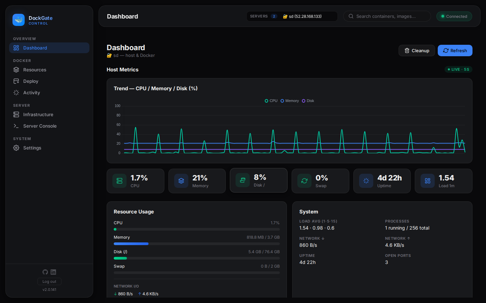 |
| **Containers** — filters, bulk actions, compose grouping | **Images** — pull/push, layers, tags, run |
| 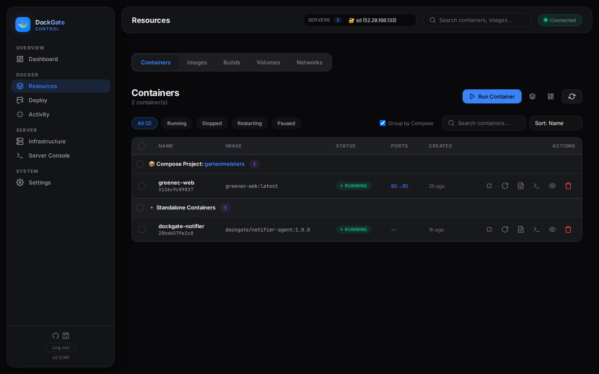 | 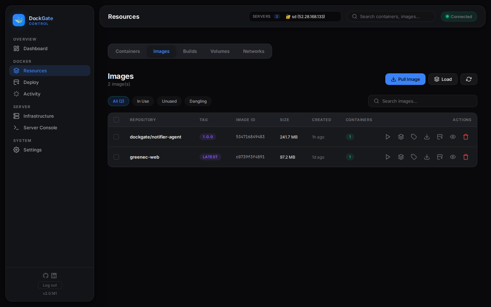 |
| **Networks** — drivers, subnets, attach/detach | **Compose** — discover, create & edit projects |
| 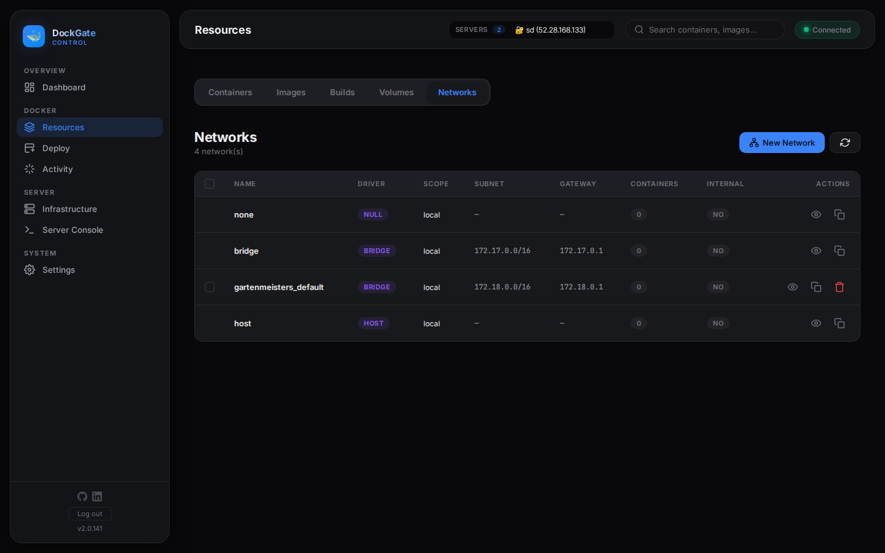 | 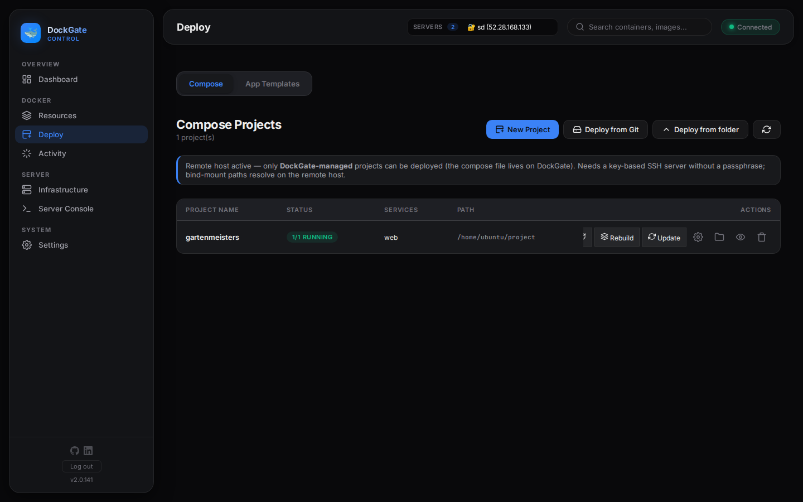 |
| **App Templates** — deploy-ready marketplace | **Terminal** — container exec + host SSH shell |
| 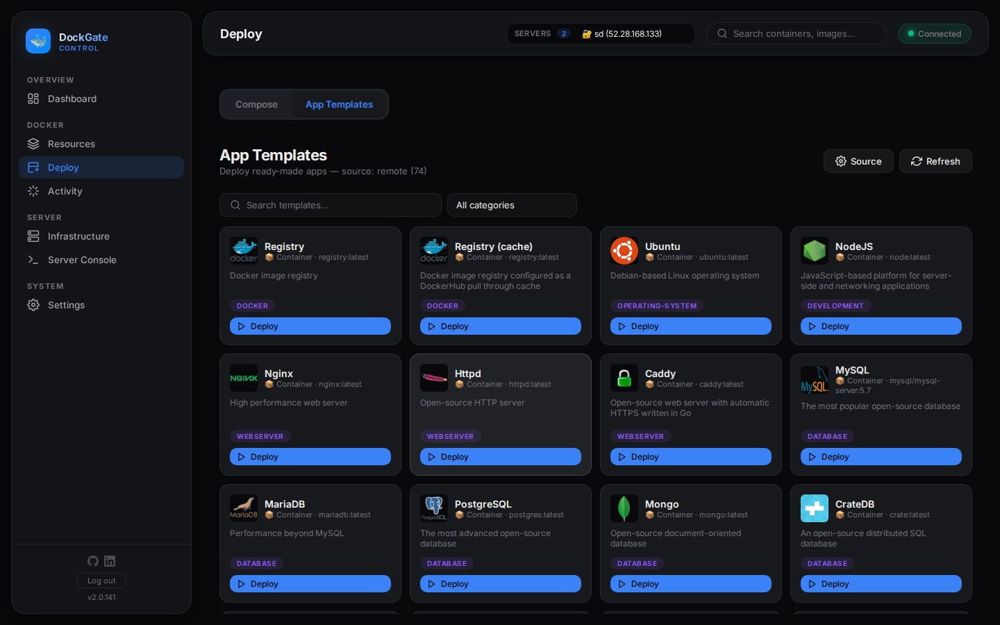 | 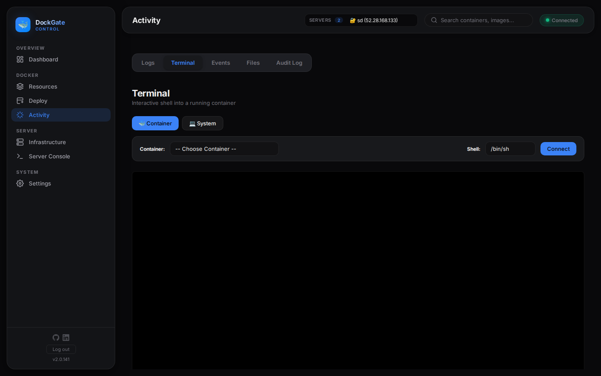 |
| **Audit Log** — every change, host & source IP | **Infrastructure** — SSH servers, registries, provisioning |
| 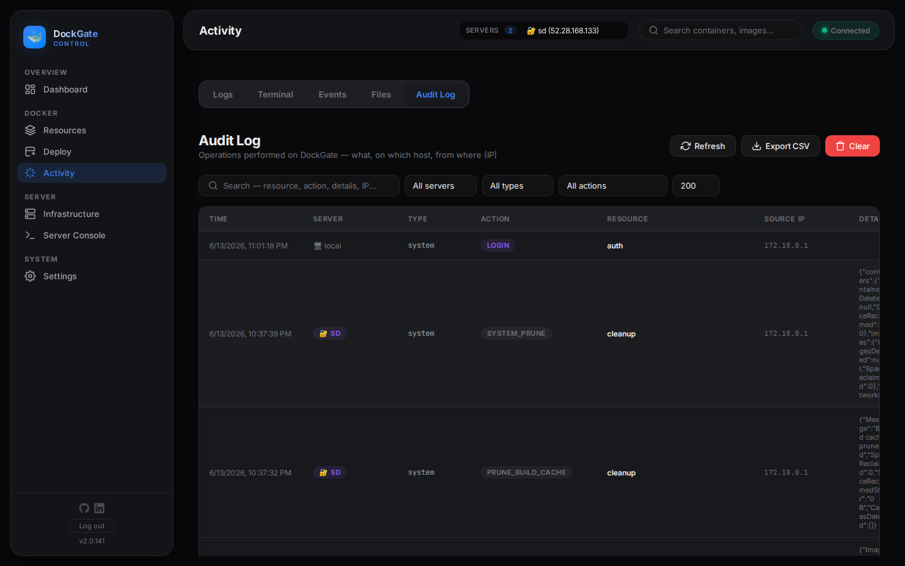 | 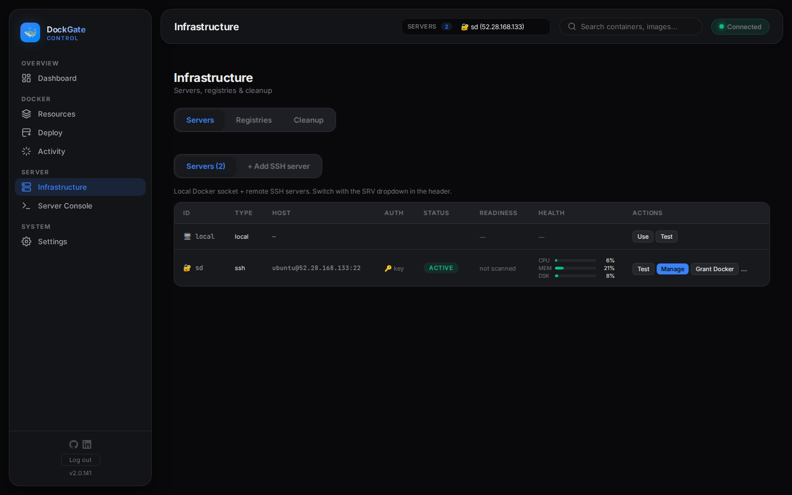 |
| **Server Console** — host services & host logs | **Notifications** — channels, rules, Edge Notifier |
| 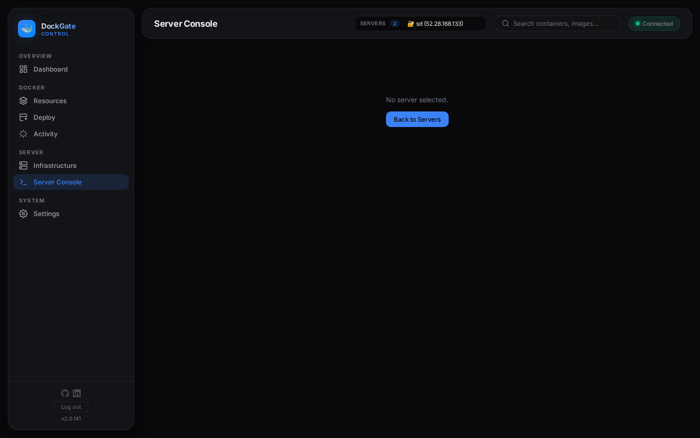 | 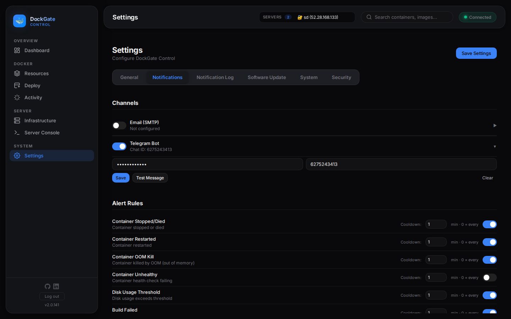 |
| **Security** — change the admin password | **System** — Docker engine & host info |
| 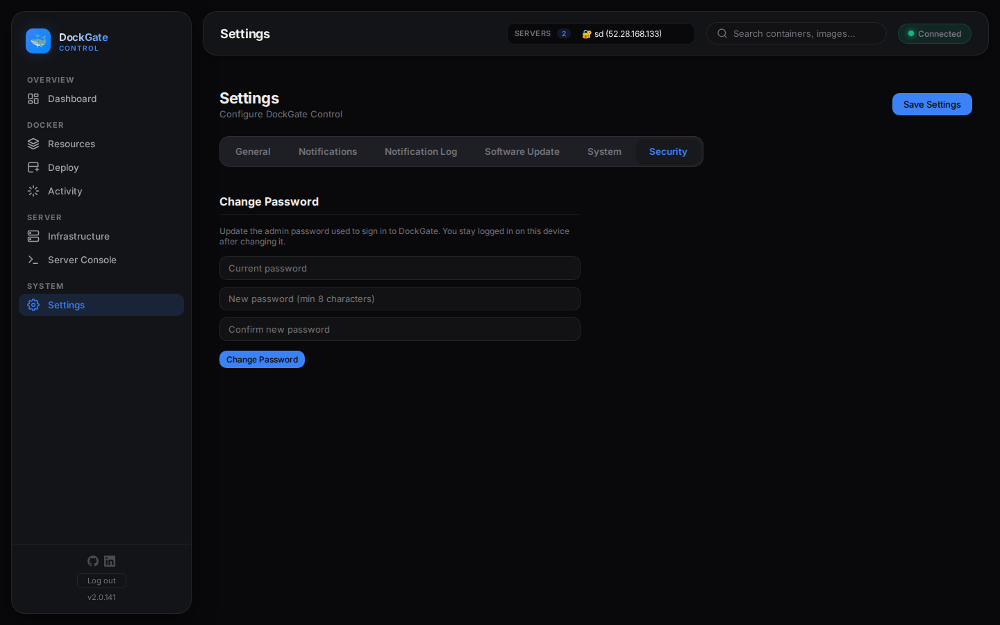 | 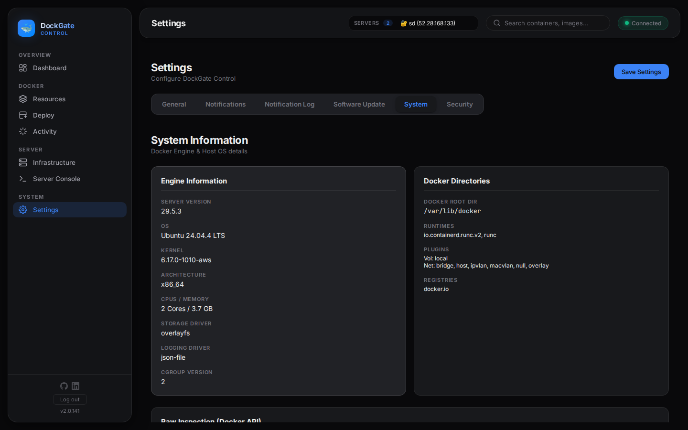 |

---

## Features

The sidebar is grouped into **Overview · Docker · Server · System**.

### 📊 Overview — Dashboard

At-a-glance view of the **active** server: count cards (containers/running/stopped/images/volumes/networks/compose), **Quick Actions** (start-all / stop-all / restart-all), top-5 CPU & memory bars, network I/O, health doughnut, uptime & restart counts, disk-usage breakdown, port map, top images by size, and **Smart Insights** (old stopped containers, unused/dangling images, detached volumes → click through to Cleanup). For a **remote** server it also embeds a live host-metrics block (CPU/RAM/disk/trend/ports/procs). Auto-refreshes every 30 s.

### 🐳 Docker

<details open>
<summary><strong>Resources</strong> — Containers · Images · Builds · Volumes · Networks</summary>

- **Containers** — table/card views, filters (All/Running/Stopped/Restarting/Paused), search & sort, **group-by-compose**, favorites/notes/tags, per-row **start/stop/restart/logs/terminal/inspect/remove**, multi-select **bulk** actions, and the guided **Run Container** modal (image w/ Hub search, ports, volumes w/ presets, env w/ "paste .env", restart policy, network, CPU/memory).
- **Container detail** — lifecycle (start/stop/restart/pause/unpause/remove), **live update** CPU/memory/restart-policy, **Recreate** (new image, keep config), **Commit**, **Export** to tar; tabs: Overview (+health), Logs, Terminal, Stats (live charts), Processes (+one-off exec), Environment, Ports, Volumes, Network (connect/disconnect), Files (browse/download/upload), Inspect (raw JSON), History.
- **Images** — list (in-use/unused/dangling), **pull** (auto-auth via stored registry creds) & **Docker Hub search**, **push**, **layers/history**, **tags** (add/untag), **save** to tar, **build-from** (inline Dockerfile), remove.
- **Builds** — build from Dockerfile / inline / Git with **live streaming log**, build history, build cache (grouped) & prune, buildx builders.
- **Volumes** — create (driver/opts/labels), **backup/restore** (.tar.gz), **clone**, browse files, remove.
- **Networks** — create (bridge/macvlan/ipvlan/overlay, subnet/gateway/internal/attachable/IPv6), inspect, **clone**, connect/disconnect containers, remove.
</details>

<details>
<summary><strong>Deploy</strong> — Compose · App Templates</summary>

- **Compose** — auto-discovers projects via the `com.docker.compose.project` label (incl. remote, and DOWN managed projects); **create & edit** in a browser YAML editor + guided "add service"; **up / down / restart / pull**; deploy to a remote host (`DOCKER_HOST=ssh://`); **deploy-from-folder**; a re-openable **Deploys console** with live job logs.
- **App Templates** — a searchable, category-filtered marketplace (Portainer App-Templates format). Deploy a **container** template → prefilled Run modal; a **stack** template → prefilled Compose editor. Bundled catalog offline, or a configurable remote URL (500+); template **detail** view with Docker Hub popularity; logos served through a same-origin proxy.
</details>

<details>
<summary><strong>Activity</strong> — Logs · Terminal · Events · Files · Audit</summary>

- **Logs** — live-tail any running container's stdout/stderr (tail 200, follow), pause/resume, clear, in-browser search, timestamps.
- **Terminal** — interactive **container exec** (sh/bash/zsh, full xterm.js PTY) **and** a **host shell** — a PTY inside the local container, or a real **SSH login shell** on a remote host.
- **Events** — live Docker daemon event feed with history range (15 m / 1 h / 24 h / live), color-coded, pause/clear.
- **Files** — **SFTP file manager** for the active **remote** server: browse, mkdir, upload/download (streamed), rename, delete; path-traversal guarded. (Local file browsing is intentionally not offered.)
- **Audit** — searchable history of **every mutation** (what / which host / from which IP / when): filter by server/type/action, full-text search, **CSV export**, clear. Single-admin, so it's a "what + from where", not "who".
</details>

### 🖥 Server

<details open>
<summary><strong>Infrastructure</strong> — Servers · Registries · Cleanup · Provisioning · Host monitoring</summary>

- **Servers** — add/edit/remove SSH hosts (host/port/user; **key** with optional passphrase, **password**, or SSH-agent — precedence key > password > agent), **test connection**, switch the active server, and **grant the docker group** (passwordless `docker`). SSH passwords/passphrases are **encrypted at rest** (AES-256-GCM).
- **Registries** — store private-registry credentials (encrypted); auto-matched by host so private **pull/push** "just works" from Images, Run and Compose. Includes a pre-save **login test**.
- **Cleanup** — preview-before-prune for stopped containers, unused/dangling images, unused volumes, unused networks, build cache, or a full system prune.
- **Provisioning** — point DockGate at a **fresh SSH server** and it runs **detect → install → verify** for a chosen preset (**Full / Secure-baseline / Just-Docker / Custom**): system update, **Docker Engine**, **fail2ban**, swap, docker-group, **safe SSH-hardening** (never disables password/root login — no lockout), and a **firewall** (SSH+80+443). Every item's detect/install/verify commands come from one central catalog; a per-server **history + state matrix** records what's done / missing / failed, with the real commands. Runs in isolated forked SSH workers so they never contend with live monitoring.
- **Host monitoring** — beyond Docker: the host's **CPU / load / RAM / swap / disk / disk-IO / net / uptime / top processes**, plus a **host-log viewer** (journald / auth / syslog / kernel / boot, any systemd unit, any `/var/log` file) over SSH. Samples opportunistically on read (no background SSH storm), stores a SQLite time-series, and draws trend charts; refreshes in place every 5 s.
</details>

<details>
<summary><strong>Server Console</strong> — host service management</summary>

Per-service **status / start / stop / restart / enable / disable** (ssh, firewall, fail2ban, docker…), plus **config editing** with a strict safety net: allowlisted paths, automatic backup, validation (`sshd -t` / `fail2ban-client -t`), auto-restore on failure, an explicit confirm, and full audit. Rich guarded ops: **fail2ban ban/unban**, **ufw allow/deny/delete** — all parameter-validated (no free-form shell).
</details>

### ⚙️ System — Settings

Tabbed: **General** (theme, default view, **timezone**, shell, log timestamps, auto-start), **Notifications** (channels + rules, below), **Notification Log**, **Software Update** (self-update from GHCR), **System** (Docker engine + host info), **Security** (change the admin password).

---

## Notifications & Edge Agent

**Channels** — **Telegram bot** and **SMTP email**. Configure/test/clear each; secrets are **encrypted at rest**. Both fire for every enabled rule.

**Alert rules (9)** — `container_die` (split into **Stopped / Crashed / OOM**), `container_restart`, `container_unhealthy`, `container_start`, `container_pause`, `container_unpause`, `disk_threshold`, `build_failed`. Each has an **enable** toggle and a **cooldown** (minutes) — **`0` = alert on every occurrence**. A `docker restart` is debounced to a **single "Restarted"** alert (not Stopped-then-Restarted), and crash/OOM/unhealthy alerts attach the container's **recent logs** so you see *why*.

**How it watches** — a central `EventMonitor` runs **per registered host** (local + every SSH server), so alerts arrive from **every** server, not just the active one.

**Edge Notifier agent (optional)** — a tiny **outbound-only** container DockGate deploys onto each server. It watches *that host's* Docker events and sends alerts **directly** to your channel — so it:

- works **behind NAT / firewalls** (no inbound ports — only a loopback healthcheck),
- **keeps alerting even if DockGate is offline**,
- installs with **zero manual steps** — DockGate auto-builds the image and ships it to the host (registry pull, or local `save`→`load` over SSH).

Manage it under **Settings → Notifications → Edge Notifier**: **Install on servers…** (multi-select), Start/Stop, Update, Remove, a **per-server channel override** (a different bot/SMTP per host), a re-openable **deploy-log**, and **auto-sync** — saving rules/channels re-pushes them to installed agents. Installing an agent stops DockGate's central monitor for that host (no duplicate alerts).

> The agent runs as root with a **read-only** docker-socket mount, `no-new-privileges`, memory/CPU caps and no published ports. A read-only socket is defense-in-depth, not a security boundary — use a dedicated alert-only bot / send-only SMTP credential, and pin the image by digest.

---

## Architecture

```
Browser (vanilla JS + xterm.js + Chart.js)
   │  cookie-gated session (login required)
   ├── HTTP/REST ─────────► Express API  (/api/*  behind requireAuth + origin check)
   │                          auth · dashboard · servers · containers · images · builds
   │                          volumes · networks · compose · registries · templates
   │                          cleanup · system · agent · meta(settings/notifications/audit)
   │
   └── WebSocket ─────────► Socket.IO  (same session cookie)
                              logs · stats · events · container PTY · host PTY · build
                                          │
                  ┌───────────────────────┼─────────────────────────────┐
                  ▼                       ▼                              ▼
          Local Docker socket     dockerode SSH transport        isolated forked SSH workers
          (/var/run/docker.sock)  (remote daemons)               (host stats / logs / provision /
                  │                       │                        service-ctl — never block the UI)
                  └─── runtime-switchable "active client" (docker Proxy singleton) ───┘

          notifications/EventMonitor  ── one per host ──►  Telegram / SMTP
          agent/deployer ── ships ──►  outbound-only Edge Notifier container (per host)
          better-sqlite3 (WAL)  ── settings, audit, servers, registries, metrics, jobs ──
          auth/secrets  ── AES-256-GCM at rest (SSH/registry/channel passwords) ──
```

**Key ideas**

- **One active Docker client.** A `docker` Proxy forwards every call to the current client — the local Unix socket or an SSH-transport dockerode client — so the whole app re-scopes to the active server instantly.
- **Isolated workers for host ops.** Host metrics, host logs, provisioning and service-control run in **forked one-shot SSH workers** (own process, agent-socket dropped) so a slow SSH host never blocks the event loop or contends with live monitoring.
- **Opportunistic sampling.** Host metrics are sampled when you read them (stored to a SQLite time-series), not polled in the background — no SSH storm.
- **Secrets at rest.** SSH passwords/passphrases, registry passwords and notification-channel tokens are AES-256-GCM encrypted (`DG_MASTER_KEY` or a generated `data/.master.key`).

---

## Security

> **Docker socket access = root-equivalent control of the host.** Treat DockGate as a privileged tool.

- **Authentication.** Single **admin password** — scrypt hash + salt, set on first run (min 8). Login issues an **HMAC-signed, HttpOnly, SameSite=Lax** session cookie (7-day TTL; `Secure` when `COOKIE_SECURE=true`). Login is **rate-limited** (10 / 15 min per IP). Change it any time in **Settings → Security**.
- **Every `/api` route and every WebSocket stream requires a valid session** — an unauthenticated client can reach nothing but the login/setup endpoints.
- **CSRF defense.** State-changing requests whose `Origin` host ≠ `Host` are rejected (403); combined with `SameSite=Lax`.
- **Encrypted at rest.** SSH, registry and Telegram/SMTP secrets are AES-256-GCM encrypted in the SQLite DB.
- **Audited.** Every mutating action (and terminal/agent/provision op) is recorded with the target host + source IP.
- **Still:** don't expose port 7077 to the public internet — put it behind a VPN/SSH tunnel (see [Remote access](#-remote-access)). And because it's single-admin, anyone with the password has full control of every connected host.

---

## Limitations

Honest, current gaps:

- **Single-tenant.** One admin password; **no multi-user, no roles/RBAC, no per-user data isolation.** Everyone with the password sees and controls everything.
- **Local-host-only operations.** Anything needing the host CLI/filesystem — Compose, buildx, build-cache prune, **self-update**, auto-start — only works when **Local** is the active server (remote daemons are managed via the Docker API only). Local host **filesystem browsing** isn't offered (remote SFTP only).
- **Provisioning / host management need SSH + (mostly) passwordless sudo** on the target; results are code-traced but should be validated on your own throwaway VPS first.
- **Edge agent caveats** — channel secrets land in the container env on each host (use a dedicated bot/credential); after a DockGate restart the central monitor isn't yet auto-suppressed for agent-hosts (possible brief duplicate alert).
- **Docker Swarm** support was **removed** (it couldn't work for the common local-manager-behind-NAT topology).

---

## Tech Stack

| Layer | Tech |
|---|---|
| Runtime | Node.js 18 (Alpine) + `docker-cli`, `openssh-client`, `git` |
| Web / real-time | Express 4 · Socket.IO 4 |
| Docker SDK | dockerode 5 (local socket + SSH transport) |
| SSH | dockerode SSH transport · `ssh2` (SFTP, host shell, workers) |
| Database | better-sqlite3 11 (WAL) |
| Email | nodemailer 8 |
| Frontend | Vanilla JS / CSS (no build step) · xterm.js · Chart.js — all **bundled in `public/vendor/`** (air-gap friendly) |
| Agent image | `notifier-agent/` — `node:22-alpine`, dockerode + nodemailer, independent semver |

Footprint: **~30–96 MB RAM, <5% CPU** at idle (capped at 256 MB / 0.5 CPU by compose).

---

## API Reference

All under `/api`, JSON, **session-gated** (except `/api/auth/{status,setup,login}`). A selection (see the source for the full surface):

**Auth** — `GET /auth/status` · `POST /auth/setup` · `POST /auth/login` · `POST /auth/logout` · `POST /auth/change-password`
**Containers** — `GET /containers` · `GET /containers/:id` · `POST /containers/:id/:action` (start/stop/restart/kill/pause/unpause/remove/rename) · `POST /containers/run` · `POST /containers/:id/exec` · `GET /containers/:id/export`
**Images** — `GET /images` · `GET /images/search?q=` · `POST /images/pull` · `POST /images/push` · `POST /images/:id/tag` · `GET /images/:id/history`
**Volumes / Networks** — full CRUD + network connect/disconnect
**Compose** — list/detail · up/down/restart/pull · `POST /compose/create` · `GET|PUT /compose/:p/file` *(local host)*
**Builds / Cleanup / System** — build history & cache · prune (containers/images/volumes/networks/cache/system) · system info/version/df
**Servers** — `GET /servers` · `POST /servers` · `PUT /servers/:id` · `POST /servers/test` · `POST /servers/active` · `DELETE /servers/:id` · provisioning + host metrics/logs + service ops
**Registries** — CRUD + `POST /registries/test`
**Templates** — `GET /templates` · `GET /templates/stackfile?url=` · `GET /templates/logo?url=`
**Agent (Edge Notifier)** — `GET /agent/status` · `POST /agent/{install,update,reconfigure,install-all,remove,power,sync}` · `GET /agent/job/:id` · `GET|POST|DELETE /agent/channel/:serverId`
**Meta** — favorites/notes/tags · `GET|POST /meta/settings` · audit (`/meta/activity`) · SMTP/Telegram · `notifications/rules` · `notifications/log` · self-update

**WebSocket** (Socket.IO, same port): `logs:subscribe` · `stats:subscribe` · `events:subscribe` · `terminal:start` (container PTY) · `hostterm:start` (host shell) · `build:start`.

---

## Configuration

| Env var | Default | Description |
|---|---|---|
| `PORT` | `7077` | HTTP port |
| `NODE_ENV` | `production` | Node env |
| `DG_MASTER_KEY` | *(generated)* | 64-hex AES key for at-rest secret encryption (else `data/.master.key`, mode 0600) |
| `DG_SESSION_SECRET` | *(generated)* | session-cookie signing secret (else persisted in DB) |
| `COOKIE_SECURE` | `false` | set `true` behind HTTPS to mark the session cookie `Secure` |
| `ALLOWED_ORIGIN` | *(same-origin)* | permit a specific cross-origin panel |

**Data** lives under `data/`: `docker-panel.db` (SQLite), `ssh-keys/` (0600), `compose/` (managed projects), `.master.key`.

---

## Contributing

1. Fork → feature branch → make changes.
2. Test: `docker compose -f docker-compose.yml -f docker-compose.dev.yml up -d --build`.
3. Run locally without Docker: `npm install && npm run dev` (needs Docker socket access) → http://localhost:7077.
4. Open a PR.

---

## 🌐 Remote Access

> Need DockGate from anywhere without static IP or port-forwarding? Use **[NovusGate](https://github.com/Ali7Zeynalli/NovusGate)** — a self-hosted WireGuard® VPN — and reach DockGate securely over the tunnel.

---

## License

[MIT](LICENSE) — free to use, modify, and distribute with attribution.

**Original Author: Ali Zeynalli** — this attribution must be preserved in all copies and derivative works.

---

<p align="center">
  <strong>DockGate</strong> — Docker &amp; servers, managed from one place.
</p>
